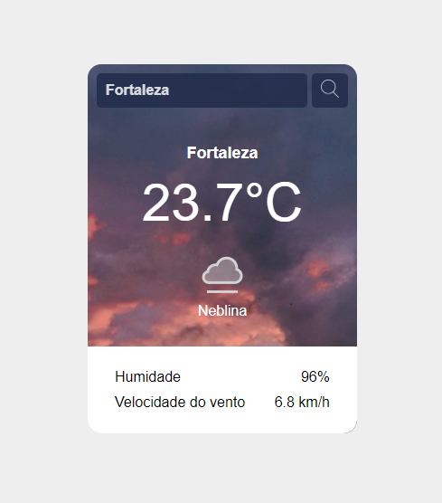

# Projeto Previsão do Tempo

Este é um projeto de desafio do curso devquest baseado no site frontend mentor e tem como principal objetivo a criação de página para busca do clima das principais cidades do mundo!

## Table of contents

- [Visão geral](#visao-geral)
  - [Screenshot](#screenshot)
  - [Link](#links)
- [Meu processo](#my-process)
  - [Construído com](#construido-com)
  - [O que eu aprendi](#what-i-learned)
  - [Desenvolvimento contínuo](#continued-development)
  - [Useful resources](#useful-resources)
- [Author](#author)
- [Acknowledgments](#acknowledgments)

## Visão geral

### Screenshot

### Links

- Link do projeto: (https://progpaulosilva.github.io/projeto-previsao-tempo/)

## Meu processo

### Construído com

- HTML semântico
- CSS
- Flexbox
- Fluxo voltado para disposítivo móvel
- Javascript

### O que eu aprendi

O principal desafio do projeto foi o consumo de API, com o uso do javascript.
Não deixando para trás as tags semânticas do html, assim como o uso do css para uma boa estilização do visual.

### Desenvolvimento contínuo

Pretendo continuar meu foco no javascrip, apefeiçoar ainda mais o HTML e praticar ainda mais o CSS. Viso já começar meus estudos em react.